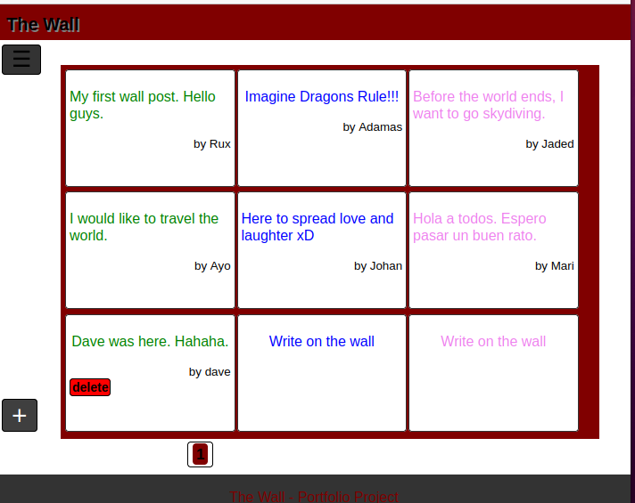

<h1>Project name - The Wall</h1>

<nav>
<ul>
<li><a href="#intro">Introduction</a></li>
<li><a href="#links">Links</a></li>
<li><a href="#install">Installation</a></li>
<li><a href="#usage">Usage</a></li>
<li><a href="#contribute">Contributing</a></li>
<li><a href="#related">Related projects</a></li>
<li><a href="#license">Licensing</a></li>
</ul>
</nav>

<h2 id="intro">Introduction</h2>
This is the project I came up with for the portfolio project phase of
the alx software engineering program.

The wall is a simple web application, designed for devices with a large screen.
It provides an outlet for expressing oneself. It is quite literally a wall where you can leave behind messages for whoever cares to read it.

  

The wall is currently being deployed on IP 100.25.188.21. It is advised to not share any sensitive information, although user passwords are encrypted on the backend, since there is no ssl certificate currently on the server. You should use a test password If you choose to explore the web application.
 
<h2 id="links">Links</h2>
	- Research and Project approval part 1
	https://docs.google.com/document/d/18fHMRXHqAuORstJIzxHysS7T1hEQ2APaDGaIbJQBPMI/edit?usp=sharing

	- Research and Project approval part 2
	https://docs.google.com/document/d/1l4lFp9BgNqUj6AveAVXSV7fX2aG-RhNKBebd3yI1Mpk/edit?usp=sharing

	- Research and Project approval part 3
	https://trello.com/invite/b/3f96xT7N/ATTIbfb3ca133bd746800869dfbb8e9472ca548D5417/the-wall

	- Building (Week 1) Making Progress
	https://docs.google.com/document/d/1udT7fwCFvUZMAt3IfiWstZAfTiOEkwQecg4NKbQrGjQ/edit?usp=sharing

	- Building (Week 2) MVP Complete
	https://docs.google.com/document/d/1EOEpR0gyuP0UFb0Q108gUJu6Ydk-bpWwl4kVP4yOzpI/edit?usp=sharing

	- Connect with the creator on linkedin
	https://www.linkedin.com/in/orumgbe-ugbekile-066804231

	- Deployed project landing page
	http://100.25.188.21

	- Portfolio Blog Post
	https://www.linkedin.com/posts/orumgbe-ugbekile-066804231_flask-activity-7110908456089395200-FuP5?utm_source=share&utm_medium=member_desktop

<h2 href="#install">Installation</h2>
	Clone the repository
  

	git clone https://github.com/Orumgbe/Portfolio_projects.git
  

	Extract project "The_Wall" from the directory or navigate to the directory within the repo
	pip install required extensions
	- flask
	- flask-bcrypt
	- flask-login
	- flask-sqlalchemy
	- flask-wtf

  <b>Ensure you have flask installed before installing the extensions</b>

<h2 href="#usage">Usage</h2>
	You can access this web application to use remotely with the link provided in the links section.
    If you wish to use this locally, you can run it locally
  

	python3 app.py
  

    That will start the flask development server in debug mode, using an sqlite database to save user profile information and posts.

<h2 href="#contribute">Contributing</h2>
	Reach out to creator on linked for contributions.
<h2 href="#related">Related projects</h2>
	As of time of publishing, there is no related project.
<h2 href="#license">Licensing</h2>
	No license.
